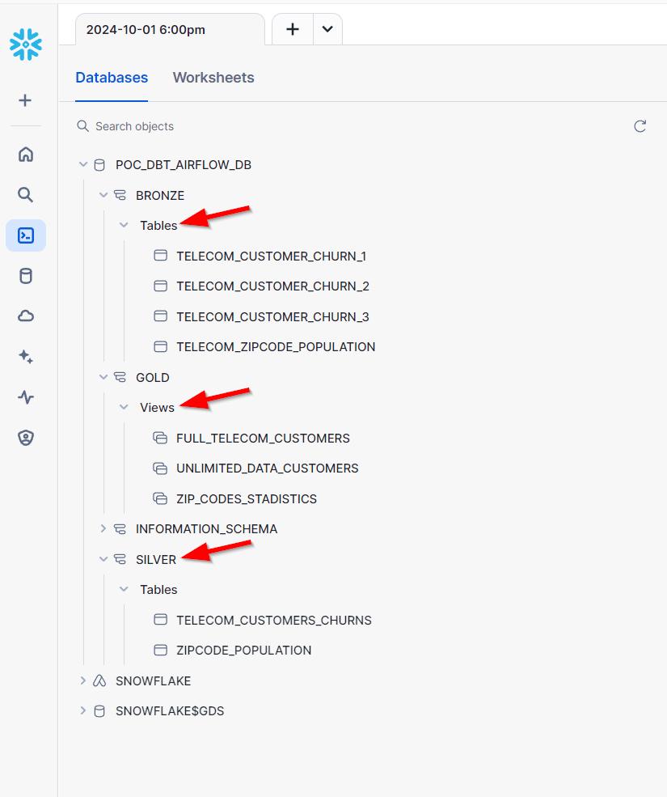

# Data Pipeline with Apache Airflow, DBT, and Snowflake

## Overview

This project demonstrates a simple data pipeline using Apache Airflow, DBT, and Snowflake. The pipeline imports raw data into Snowflake, applies DBT transformations, and produces clean, analysis-ready datasets for BI tool visualization.

## Prerequisites

- Docker
- Astro CLI
- Snowflake account

## Important Notes

- This project will consume a few Snowflake credit (a few dollars).
- Ensure the Airflow pipeline is functioning correctly to avoid additional costs from retries.
- Follow the Snowflake cleanup instructions at the end of this guide.

## Dataset

We use a Maven Analytics sample dataset containing churn customer data from a fictional telecom company:
- Primary CSV: 38 columns, 7,043 California-based customers (personal, contractual, and revenue details)
- Secondary CSV: Zip code and population information

[Dataset Source](https://mavenanalytics.io/data-playground)

## Project Structure

- `dags/`: Airflow DAG files (includes `poc_dbt_snowflake` DAG)
- `Dockerfile`: Astro Runtime Docker image
- `include/`: Additional project files
- `packages.txt`: OS-level package requirements
- `requirements.txt`: Python package requirements
- `plugins/`: Custom or community Airflow plugins
- `airflow_settings.yaml`: Local Airflow configuration file

## Snowflake Setup

1. Login as `ACCOUNTADMIN` in Snowflake
2. Execute the following SQL commands:

```SQL
CREATE DATABASE POC_DBT_AIRFLOW_DB;
CREATE ROLE DBT_AIRFLOW_ROLE;
CREATE USER DBT_AIRFLOW_USER PASSWORD='abc123' DEFAULT_ROLE = DBT_AIRFLOW_ROLE DEFAULT_SECONDARY_ROLES = ('ALL') MUST_CHANGE_PASSWORD = TRUE;
GRANT ROLE DBT_AIRFLOW_ROLE TO USER DBT_AIRFLOW_USER;
CREATE OR REPLACE WAREHOUSE DBT_AIRFLOW_WH WITH WAREHOUSE_SIZE='X-SMALL';
GRANT USAGE, OPERATE ON WAREHOUSE DBT_AIRFLOW_WH TO ROLE DBT_AIRFLOW_ROLE;
GRANT OWNERSHIP ON DATABASE POC_DBT_AIRFLOW_DB TO ROLE DBT_AIRFLOW_ROLE;
GRANT ALL PRIVILEGES ON DATABASE POC_DBT_AIRFLOW_DB TO ROLE DBT_AIRFLOW_ROLE;
```

3. Login to Snowflake as `DBT_AIRFLOW_USER` and set a new password

## Local Deployment

1. Install Astro CLI: [Installation Guide](https://www.astronomer.io/docs/astro/cli/install-cli)

2. Start Airflow:
```
astro dev start
```

3. Verify Docker containers:
```
docker ps
```

4. Access Airflow UI: http://localhost:8080/ (Username and Password: admin)

5. Configure Snowflake Connection in Airflow:
   - Navigate to Admin -> Connections
   - Add a new Snowflake connection:
     - Connection Id: `snowflake_conn`
     - Login: `DBT_AIRFLOW_USER`
     - Password: (New password set in step 3 of Snowflake Setup)
     - Account: Your Snowflake Account Id
     - Warehouse: `DBT_AIRFLOW_WH`
     - Database: `POC_DBT_AIRFLOW_DB`
     - Region: Your Snowflake region (e.g., `us-east-1`)
     - Role: `DBT_AIRFLOW_ROLE`
     - Disable OCSP certificate check for local testing
   - Test the connection


6. Trigger the DAG in Airflow UI


7. Validate data in Snowflake



## Snowflake Cleanup

Execute the following SQL commands to clean up Snowflake resources:

```SQL
DROP WAREHOUSE IF EXISTS DBT_AIRFLOW_WH;
DROP USER IF EXISTS DBT_AIRFLOW_USER;
DROP ROLE IF EXISTS DBT_AIRFLOW_ROLE;
DROP DATABASE IF EXISTS POC_DBT_AIRFLOW_DB;
```

## Credits

Forked from [ClearPeaks/poc-dbt-airflow-snowflake](https://github.com/ClearPeaks/poc-dbt-airflow-snowflake)

For more information, see [Orchestrating DBT on Snowflake using Airflow and Astro](https://www.clearpeaks.com/orchestrating-dbt-on-snowflake-using-airflow-and-astro/)
